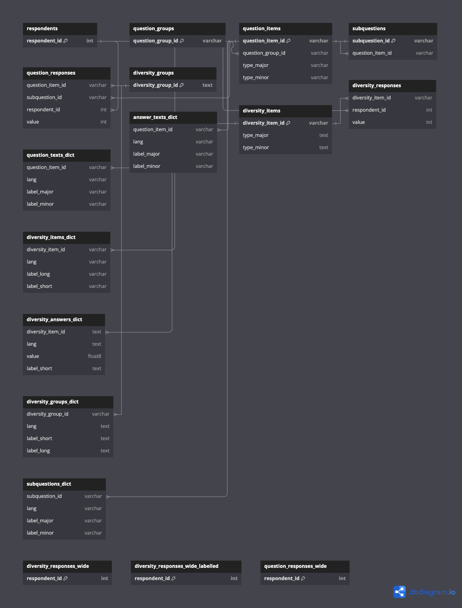

# Creation/modification of ETL pipelines in Airflow
This repository contains three demo DAGs:

- `extract_limesurvey_data`: This DAG includes functionality to extract some raw data from Limesurvey using SSH and load it to the `raw` schema in the target database. The names of the tables that should be extracted are specified in line 14 of [`airflow/dags/extract_limesurvey_data.py](../../airflow/dags/extract_limesurvey_data.py). You can add/modify the values in the list to change what data is extracted. This DAG will fail if either of the tables does not exist in the Limesurvey DB.
- `run_dbt_meta_tables`: This DAG runs the dbt models to transform the meta tables, e.g., question answers, question items, respondents, etc. After successful completion, the transformed data will be available in the reporting schema of the target database. The [dbt models](../../limesurvey_dbt/models/meta_tables/) used for these transformations use some [seed data](../../limesurvey_dbt/seeds/) to replace values based on some mappings. The replacement values in the .csv files are fictional, so you might want to add you own values here.
- `run_dbt_surveys`: This DAG runs the dbt models to transform the actual survey data. After successful completion, the transformed data will be available in the reporting schema of the target database. The dbt models to transform the survey data are located in [limesurvey_dbt/models/surveys](../../limesurvey_dbt/models/surveys/). The folder currently contains a demo model [`lime_survey_977429.sql`](../../limesurvey_dbt/models/surveys/lime_survey_977429.sql). Note that `lime_survey_977429` is also part of the extracted tables specified in line 14 in [airflow/dags/extract_limesurvey_data.py](../../airflow/dags/extract_limesurvey_data.py).

## Adding a new survey to the ETL pipeline
Adding a new survey is simple. It only requires you to make a few changes. Let's say you want to add a survey that is called `lime_survey_123456`:

1. Add the table `lime_survey_123456` to the list of extracted tables in line 14 of [airflow/dags/extract_limesurvey_data.py](../../airflow/dags/extract_limesurvey_data.py).
2. Create a new file [limesurvey_dbt/models/surveys/lime_survey_123456.sql](../../limesurvey_dbt/models/surveys/). Add the following content to the newly created   file and save the changes:

    ```sql
    {{ transform_survey('lime_survey_123456') }}
    ```
3. Modify [limesurvey_dbt/models/surveys/schema.yml]:

- Under models, add a new entry:

  `- name: lime_survey_123456`
- Under sources, add a new table to the existing source (just below lime_survey_977429):

    `- name: lime_survey_123456`

That's it. When the DAGs are executed the next time, the new survey should be extracted, transformed, and loaded to the reporating table.

## Monitoring / running a DAG
You can click on the DAG to open Airflow's grid view and monitor the DAG runs. In this view, you can also manually trigger a DAG by clicking on the small play-button in the upper right corner. Otherwise, the DAGs will be run on a schedule, which is specified in [airflow/dags/extract_limesurvey_data.py](../../airflow/dags/extract_limesurvey_data.py):

- The data extraction DAG is scheduled at 5 AM every day
- Upon successful completion of the extract steps, the dbt-DAGs are triggered automatically

# Viewing the reporting data
When you run the `docker compose up` command with the `--profile fullDeployment` flag, a target database will be created for you. It is served at `localhost:5433` and you can access it using a tool like [pgcli](https://www.pgcli.com/) or [dbeaver](https://dbeaver.io/).

For example, you can connect using pgcli using the following command in your terminal:

```bash
pgcli -u <TARGET_DB_USERNAME> -p 5433 -h localhost -d <TARGET_DB_NAME>
```
You will be asked to enter your password, i.e., `<TARGET_DB_PASSWORD>`.

# Data Model
.
